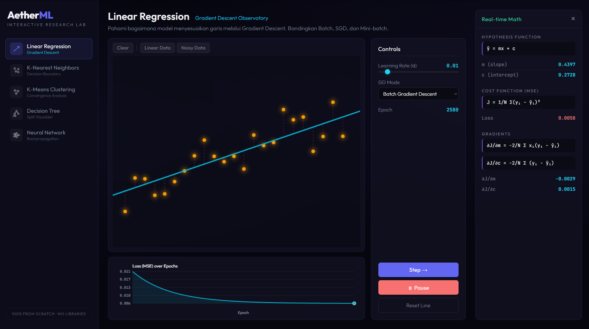

# AetherML Visualizer

AetherML Visualizer is an interactive web-based research laboratory designed to provide deep visual and mathematical insights into core Machine Learning algorithms. 

Created by ansel.

## Overview

Unlike standard black-box machine learning demonstrations, this project emphasizes mathematical transparency and visual feedback. All algorithms are implemented from scratch using Vanilla HTML, CSS, and Javascript without relying on heavy external libraries like TensorFlow or Scikit-Learn.

The application includes five core interactive modules:

1. **Linear Regression (Gradient Descent Observatory)**
   Visualizes how a regression line fits a dataset through iterative parameter updates. Features Batch, Stochastic (SGD), and Mini-batch gradient descent modes alongside a real-time loss (MSE) curve.

2. **K-Nearest Neighbors (Decision Boundary Lab)**
   A pixel-wise classification visualizer demonstrating how KNN partitions space based on K-neighbors and distance metrics (Euclidean, Manhattan, Minkowski).

3. **K-Means Clustering (Convergence Analyzer)**
   Simulates the iterative process of K-Means clustering, comparing K-Means++ and Random initialization, complete with centroid movement tracking and WCSS (Inertia) monitoring.

4. **Decision Tree (Split Visualizer)**
   Dynamically builds and visualizes an axis-aligned decision tree based on Gini Index or Entropy. Includes interactive pruning via max-depth controls and a live tree structure diagram.

5. **Neural Network (Backpropagation Debugger)**
   A from-scratch multilayer perceptron (MLP) implementation. Demonstrates forward propagation, activation functions (Sigmoid, ReLU, Tanh), and gradient descent via backpropagation, visualized through a weight-heatmap network diagram.

## Project Structure

The project uses a clean, zero-dependency architecture:
- `index.html`: The main SPA interface and layout structure.
- `styles.css`: A comprehensive, grid-based styling system utilizing a dark-mode, glassmorphism aesthetic.
- `src/main.js`: The central router managing module switching and panel coordination.
- `src/algorithms/`: Contains the core mathematical implementations for each machine learning module.
- `src/utils/`: Shared utilities including canvas manipulation, math operations, and dataset generators.

## Usage

Since the project operates entirely client-side, no server configuration is required. Simply open the `index.html` file in any modern web browser to launch the application.

## Documentation

Below are captures demonstrating the Linear Regression module in action during the gradient descent training process.

**Gradient Descent (Running)**

**Gradient Descent (Paused)**

